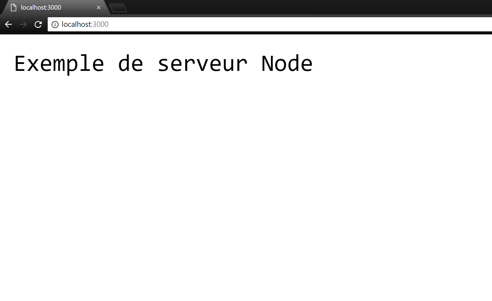

# Node.js

Node est beaucoup plus qu'un cadriciel : c'est en effet un environnement d'exécution complet qui permet de rouler JavaScript à l'extérieur d'un fureteur web. Node est bâti sur le V8 Engine de Chrome et est facilement utilisable sur plusieurs plateformes (Windows, Linux, OS X).

Contrairement à d'autres technologies de serveurs web (_Apache HTTP_ par exemple), Node.js roule sur un seul fil d'exécution et se base plutôt sur une exécution asynchrone et un système d'événements. Ceci veut dire que les appels vers Node.js ne sont pas bloquants et qu'un serveur Node n'attend pas le retour des data d'un appel et traite le prochain appel. Le système de notifications d'événements signale au serveur qu'une réponse d'un appel est finalement prête.

La structure asynchrone rend Node efficace pour des tâches qui impliquent beaucoup d'actions simples ou lourdes en IO (Entrée/Sortie), mais moins performantes si les tâches impliquent une très large utilisation du CPU. Il est important de connaître les limites de chaque technologie pour faire le meilleur choix pour chaque projet.

# Installation

Pour installer Node sur votre machine, vous pouvez [cliquer ici](https://nodejs.org/fr/download/). Une fois que vous avez installé Node, vous pouvez ouvrir une console et rentrer la commande suivante :

```powershell
node -v
```
Présentement, la dernière version stable est **8.11.3**. Assurez-vous de rester à jour le plus possible avec les versions de Node pour avoir les fonctionnalités les plus récentes.


Si vous entrez simplement **node** dans le terminal, vous aurez un interpréteur complet de Node et vous pouvez écrire du code JavaScript directement dans la console. Ceci permet de rapidement prototyper ou essayer des commandes. Pour sortir de ce mode, il suffit d'entrer **^C** deux fois ou **.exit** 


Vous pouvez essayer l'exemple suivant. La console devrait afficher 4 :
```js
test = (a,b) => { return a + b}
test(2,2)
```

# Créer un serveur

Comme nous avons déjà mentionné, Node est très utilisé pour créer des serveurs web. Dans cette partie, nous allons créer un serveur web très simple. On vous recommande de créer un fichier **server.js** et utiliser le même fichier à travers les différents exemples. 

## 1re étape : Importer les modules requis
Pour avoir un serveur, nous avons besoin de quelques outils supplémentaires. Heureusement, Node vient avec plusieurs _modules_ déjà existants. Pour un serveur web, nous avons besoin du module **http** et on peut l'ajouter à notre application de la manière suivante à notre fichier **server.js**:

```js
var http = require('http')
```

## 2e étape : Créer le serveur
Maintenant que nous avons le module **http**, nous devons créer le serveur et lui dire d'écouter sur un port quelconque pour des connexions externes. Ceci est fait grâce aux fonctions **createServer()** et **listen** de notre variable **http** de la première étape. 

À l'intérieur de **createServer()**, nous allons dire au programme ce qu'il faut faire lorsqu'une connexion est établie avec le serveur. Pour le moment, nous allons envoyer qu'un simple message texte à chaque connexion.

```js
http.createServer( function(request,response){
    // Mettre les entêtes HTTP
    response.writeHead(200,{'Content-Type':'text/plain'});

    //Envoyer notre message
    response.end('Exemple de serveur Node\n');
}).listen(3000);
```

## 3e étape : Tester le serveur

Nous avons maintenant un serveur Node très simple qui terminé. Si on veut le tester, il faudrait le démarer et y accéder avec un fureteur web.
Pour le partir, il faut tout simplement ouvrir une console dans le répertoire de notre fichier **server.js** et utiliser la commande **node** comme suit :

```powershell
node server.js
```

Pour tester, il faut simplement ouvrir n'importe quel fureteur web et aller à l'adresse **localhost:3000/** et on doit être capable de voir le résultat suivant :



