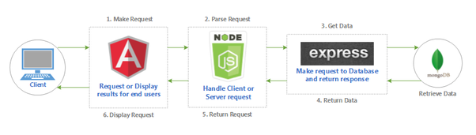

# MEAN Stack

Le _MEAN_ Stack est un ensemble de technologies en _JavaScript_ qui permettent de développer des sites et des applications web. _MEAN_ couvre le côté client et le côté serveur d'une application web et permet de créer l'ensemble d'une application en un seul langage.

_MEAN_ est composé de quatre technologies différentes :

- **M**ongoDB : une base de donnée de type NoSQL  [Vous pouvez trouver MongoDB ici](https://www.mongodb.com/)
- **E**xpress : un cadriciel basé sur Node.js. Très utile pour créer des applications webs et des APIS [Vous pouvez trouver Express ici](https://expressjs.com/)
- **A**ngular : un cadriciel JavaScript qui permet de développer des pages webs selon un modèle MVC [Vous pouvez trouver Angular ici](https://angular.io/)
- **N**ode : un environnement d'exécution JavaScript construit sur le moteur JavaScript V8 de Chrome. [Vous pouvez trouver Node ici](https://nodejs.org/fr/) 

_MEAN_ peut être essentielleemnt divisé en trois parties : client (Angular), serveur (Node + Express) et données (MongoDB).

L'avantage d'avoir une telle séparation est que chaque composante du stack peut être remplacé par une autre technologie si le développeur le souhaite. Par exemple, Angular peut être remplacé par React ou Vue.js et le reste de l'application du côté serveur n'a pas besoin d'être modifiée.
_MEAN_ est utilisé surtout à cause de l'intégration facile entre les différentes modules et l'utilisation du même langage de programation sur tout le projet.

