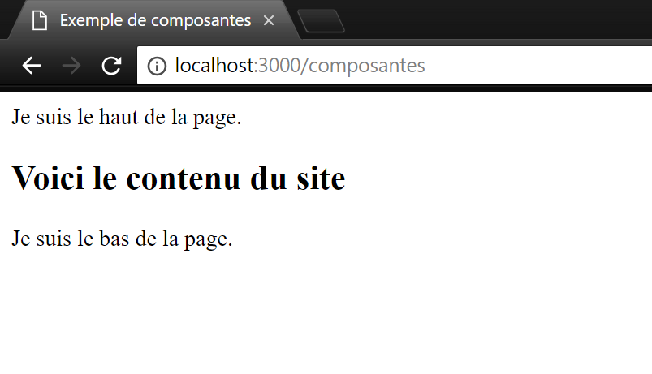

# Template engine

Afin d'éviter d'avoir du code HTML et des manipulations lourds de strings pour envoyer des pages HTML à partir du serveur, **Express** supporte plusieurs outils qu'on appelle des **Template engine** avec **Pug** (formellement _Jade_) comme l'engin le plus populaire. **Pug** permet de générer du code HTML valide tout en simplifiant l'écriture de pages HTML et en incluant certainnes fonctionnalités supplémentaires.

Pour pouvoir utiliser **Pug**, il faut premièrement l'installer avec npm avec la commande suivante : **npm install --save pug**.

Ensuite, il faut spécifier à **Express** qu'il doit utiliser **Pug** et ou les fichiers _.pug_ peuvent être trouvés. On recommande fortement de les mettre dans un répertoire **views** à la même place que votre serveur. Voici comment ajouter **Pug** :

```js
app.set('view engine','pug') // faut utiliser Pug
app.set('views','./views')   // ou trouver les fichiers
```

Maintenant, dans le répertoire 'views', vous pouvez créer un fichier **premier_exemple.pug** et mettre le contenu suivant (attention : **Pug** est sensible à l'indentation) :

```pug  
doctype html
html
    head
        title = "Premier Exemple Pug"
    body
        p.message#messageID HelloWorld!
```

Ceci est converti en HTML lorsque c'est envoyé au client. En effet, voici ce que ce code donne en HTML :

```html
<!DOCTYPE html>
<html>
   <head>
      <title>Premier Exemple Pug</title>
   </head>
   
   <body>
      <p class = "message" id = "messageID">Hello World!</p>
   </body>
</html>
```

Comme on peut voir, **Pug** permet de :
- Éviter d'avoir des balises fermantes et ouvrantes. Tout se fait par l'indentation
- Simplifie la déclaration de classes (**.**) et id (**#**) 

Et finalement, pour pouvoir afficher la page, il faut être capable de la retourner lorsqu'elle est demandée au serveur. Ceci est fait avec la fonction **render** au lieu du **res.send** habituel qui avait été utilisé jusqu'à date dans le tutoriel.

```js
app.get('/pug',function(req,res){
    res.render('premier_exemple');
})
```

# Des variables dans les templates

**Pug** permet de passer des variables directement dans les templates à partir de nos routes définies dans le serveur. On peut même utiliser les variables à l'intérieur d'un texte avec la syntaxe suivante : #{NomDeVariable}.

Pour illustrer ceci, créez un fichier **dynamique.pug** dans le répertoire 'views' et mettez le texte suivant:

```pug
html
    head
        title=nom
    body
        h1 Ceci est un tutoriel de #{nom}
        a(href = url) cliquez ici
```

Et dans votre serveur, vous devez ajouter la route suivante :

```js
var express = require('express');
var app = express();
app.set('view engine','pug') // faut utiliser Pug
app.set('views','./views')   // ou trouver les fichiers

app.get('/pug',function(req,res){
    res.render('premier_exemple');
})

app.get('/dynamique', function(req, res){
   res.render('dynamique', {
      nom: "Pug", 
      url:"https://pugjs.org/api/express.html"
   });
});

app.listen(3000);
```

# Composantes

**Pug** offre une autre fonctionnalité qui permet de simplifier la création de pages HTML : les composantes. Souvent, les sites web qu'on visite ont un haut et un bas de pages qui reste pareil à travers les différentes parties du site, souvent contenant le menu de navigation pour le haut. Avec du HTML classique, le code pour chaque composante devrait être copié dans chaque fichier, ce qui devient rapidement laboureux. **Pug** permet d'écrire ce code 1 fois et l'ajouter en faisant référence au fichier original de la composante avec le mot clé **include**. 

Pour un exemple concret créez 3 nouveaux fichiers avec le contenu suivant :

**header.pug**

```pug
div.header.
    Je suis le haut de la page.
```

**composantes.pug**

```pug
html
    head
        title Exemple de composantes
    body
        include ./header.pug
        h2 Voici le contenu du site
        include ./footer.pug
```

**footer.pug**

```pug
div.footer.
    Je suis le bas de la page.
```

Ensuite, il faut rajouter la route vers notre nouvelle page :

```js
app.get('/composantes', function(req, res){
    res.render('composantes');
});
```

Si vous visitez '/composantes', vous devez voir le résultat suivant :



Vous pouvez modifier vos autres templates pug en incluant le haut et le bas de page de que vous venez de créer et voir que ces 2 éléments sont toujours présents