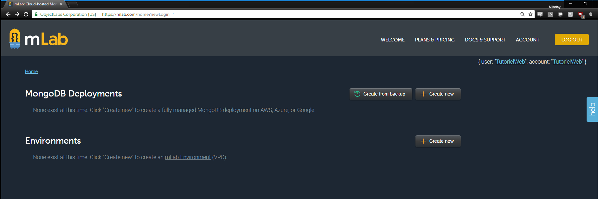
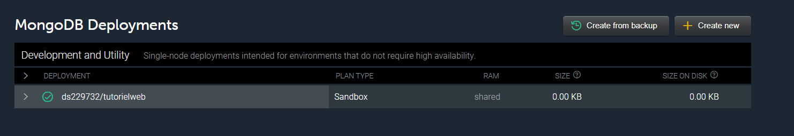
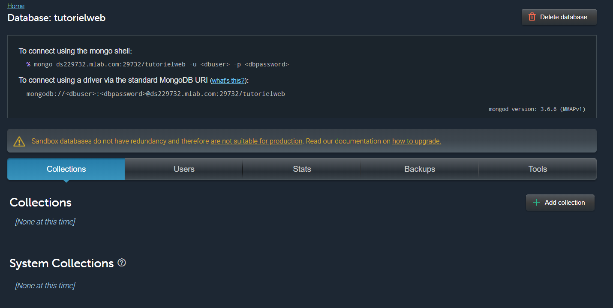

# MLab

Pour ce tutoriel, nous allons utiliser **MLab**, une plateforme qui offre des instances gratuites de **MongoDB** avec une capacité de 500 MB. **MLab** va vous permettre de vous familiariser avec **MongoDB** et un serveur de base de données qui ne partage pas le même lieu physique (votre ordinateur) que le serveur. De plus, **MLab** offre une interface utilisateur facile à utiliser et permet de voir plus d'information, plus rapidement que l'outil en ligne de commande de **MongoDB** locale.

## Créer une base de données

Avant de pouvoir utiliser **MLab**, il faut créer un compte sur leur [site](mlab.com). La création de compte est rapide est gratuite. Si vous avez réussi, vous pouvez rentrer dans le site et vous aurez l'interface suivante :



Maintenant, il faut créer une base de données et vous pouvez le faire à travers le bouton **Create new** à côté de la section **MongoDB Deployments**. Vous pouvez choisir le Cloud Provider parmi _Amazon, Google_ et _Microsoft_ et sélectionnez le Plan **Sandbox** qui offre une version gratuite avec 500 MB de place disponible. En fonction du Provider choisi, vous devez sélectionner un serveur physique et, finalement, un nom pour votre base de données. La seule contrainte est que le nom ne doit pas avoir des espaces et doit être tout en minuscules. Si tout se passe bien, vous devez avoir votre nouvelle base de données sous la liste de déploiements :



Si vous cliquez sur le nom de votre base de données, vous devez voir l'interface de gestion de la base avec les onglets _Collections, Users, Stats, Backups_ et _Tools_ ainsi qu'un premier encadré avec l'URI à utiliser pour se connecter.



## Première connexion

La première chose à faire pour se connecter à notre base de données est d'ajouter des utilisateurs qui ont accès. **Attention** : votre nom d'usager de votre compte n'est pas l'usager pour se connecter à votre base de données. Chaque base de données peut avoir sa propre liste d'utilisateurs dédiés.

Pour rajouter un utilisateur, vous devez aller dans l'onglet **Users** et cliquer sur le bouton **Add database user**. Chaque nouvel utilisateur a un nom et un mot de passe et il peut être aussi créé en mode _read-only_ ce qui veut dire qu'il ne peut pas modifier les données de la base de données.

Maintenant que nous avons une base de données et un utilisateur, on peut se connecter. Le premier encadré de chaque base de données Mlab indique l'URL que vous avez besoin d'utiliser pour vous connecter. Dans l'exemple suivant, chaque partie de l'URL a été séparée pour mieux comprendre ce qui va dans l'URL. Pour le moment, tous ce qu'on a besoin, c'est du module node **mongodb** et on peut l'obtenir en faisant **npm install --save mongodb**. Vous devez aussi remplacer les informations telles que l'usager, son mot de passe, le host et le nom de votre base de données pour vos connecter. Créez un fichier **mongoClient.js** et mettez le code suivant :

```js
var MongoClient = require('mongodb').MongoClient;

// À MODIFIER PAR VOUS
var DB_USER = "userName";
var DB_PASSWORD = "userPassword";
var DB_DB = "dataBaseName";
var DB_HOST = "ds[6 chiffres].mlab.com";
var DB_PORT = "dbPort";

var DB_URL = "mongodb://" + DB_USER + ":" + DB_PASSWORD + "@" + DB_HOST + ":" + DB_PORT + "/" + DB_DB;

MongoClient.connect(DB_URL,{useNewUrlParser : true}, function(err,client){
    if(!err){
        console.log("Nous sommes connectés à " + client.s.options.dbName);
    }
    else{
        console.log(err);
    }
});
```
Si vous exécutez le script, vous devez voir le message **Nous sommes connectés à ** suivi du nom de votre base de données.

## Première collection

Nous avons besoin d'une collection pour contenir nos données. **Mlab** offre la possibilité de créer des collections directement dans l'interface graphique à travers le bouton **Add collection** et en entrant le nom de la collection. Une fois que vous avez créé votre collection, elle est visible dans le menu principal et vous pouvez y accéder et même insérer des objets directement dans l'interface Web.

Pour plus d'information sur comment exactement utiliser **MongoDB** vous pouvez vous référer à la section suivante du tutoriel.